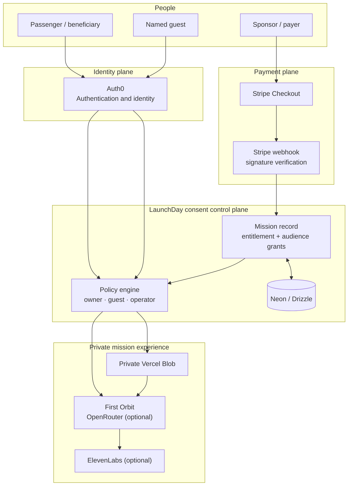
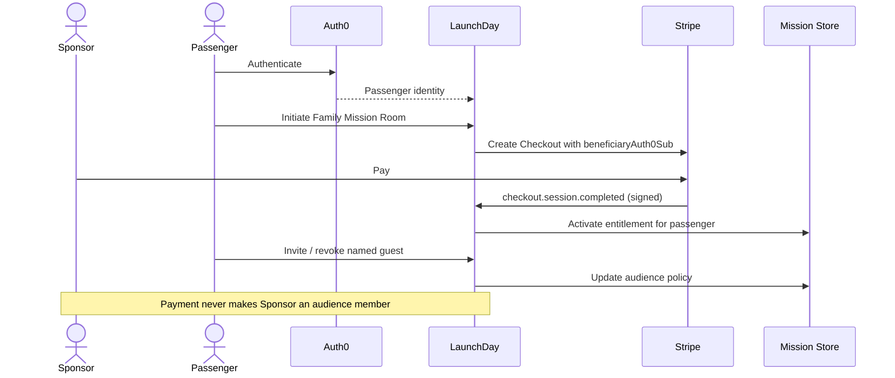

# LaunchDay architecture

LaunchDay has one critical architectural decision: **the payment record is not the access-control record**. The system writes an entitlement after payment, then lets the passenger’s Auth0 identity control who can experience the private mission room.

## System map

## Consent Checkout sequence

## Trust boundaries

### 1. Payment activation

`src/app/api/stripe/webhook/route.ts` verifies Stripe’s webhook signature before it activates an entitlement. Browser redirects and client-side state never activate a paid feature in the live path.

### 2. Passenger ownership

`src/lib/authorization.ts` compares the current Auth0 viewer with the mission’s passenger identity. Only that passenger—or a deliberately defined operator—can purchase, invite, revoke, upload, or generate the story.

### 3. Guest access

Guests must authenticate, match an invited email address, and have an active non-revoked grant. The entitlement must also be active. A sponsor does not receive a grant automatically.

### 4. Private media

Uploads use a short-lived Vercel Blob token created after an owner check. Reads use `/api/media`, which repeats the identity and audience-policy check before private media is streamed.

### 5. AI services

Private Blob objects are read server-side. The story endpoint sends an in-memory vision input only after authorizing the owner. ElevenLabs narration is streamed only to an authorized viewer. These providers are optional so demo mode does not pretend to make a network call.

## Data model

The `missions` record is the product’s source of truth:

| Field | Purpose |
| --- | --- |
| `passenger` | Auth0-subject-backed beneficiary and owner |
| `entitlement` | Payment state, payer attribution, Stripe Checkout session ID |
| `accessGrants` | Named, time-bound, revocable family guests |
| `images` | References to passenger-controlled media |
| `story` | The private First Orbit output |

No credit card data, Stripe API key, or Auth0 secret is ever stored in the mission record.

## Demo-mode contract

When provider credentials are absent, LaunchDay deliberately switches to a local in-memory demo path. The UI keeps the same consent model, but it labels the mode clearly and never claims that a live Stripe payment, Auth0 session, or third-party AI call occurred.

## Deployment checklist

1. Configure the HTTPS deployment URL in Auth0 callbacks, logout URLs, and web origins.
2. Set `APP_BASE_URL` to the deployed URL.
3. Register `https://YOUR_DOMAIN/api/stripe/webhook` in Stripe.
4. Use a private Vercel Blob store.
5. Set all production environment variables in the hosting platform—never in the repository.
6. Run `npm run lint && npm run build` before every release.
