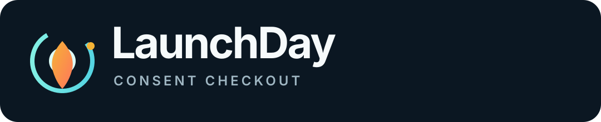
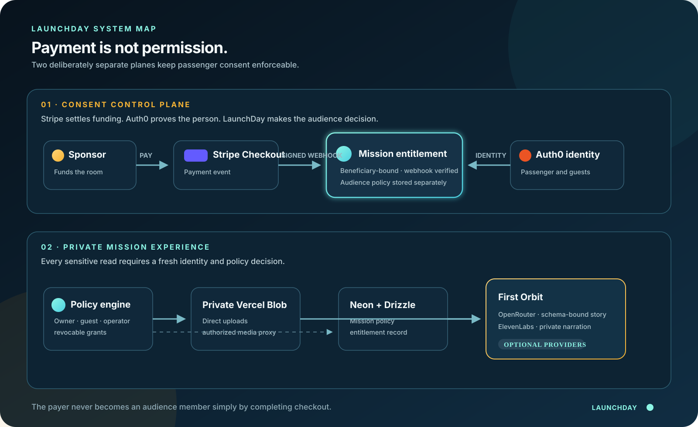
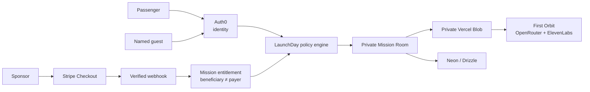

<p align="center">
  
</p>

<p align="center">
  <strong>Consent Checkout for civilian spaceflight.</strong><br />
  A payment primitive where the payer, beneficiary, and audience are three different people—with consent enforced in the product, not a disclaimer.
</p>

<p align="center">
  <a href="#the-idea"></a>
  <a href="#architecture"></a>
  <a href="#architecture"></a>
  <a href="#run-locally"></a>
  <a href="./LICENSE"></a>
</p>

<p align="center">
  <a href="#watch-the-demo">Watch the demo</a> · <a href="#architecture">Architecture</a> · <a href="#run-locally">Run locally</a> · <a href="./DEMO_RUNBOOK.md">Demo runbook</a> · <a href="./CONTRIBUTING.md">Contribute</a>
</p>

<p align="center">
  
</p>

<p align="center">
  <sub>Hero image: NASA, <a href="https://images.nasa.gov/details-iss058e005282">ISS058-E-005282</a>.</sub>
</p>

---

## The idea

Space tourism will create a new category of purchase: **one person pays for another person’s once-in-a-lifetime experience**. Existing checkout systems collapse the important identities into one account. That is wrong for a parent sponsoring a daughter’s flight, an employer funding an astronaut experience, or a partner gifting a mission.

LaunchDay creates a **Consent Checkout**:

| Identity | What they can do | What they cannot do |
| --- | --- | --- |
| **Sponsor** | Fund the Family Mission Room through Stripe Checkout | View or share the passenger’s private mission by virtue of payment |
| **Passenger** | Own the entitlement and invite a named audience | Be locked out by the sponsor |
| **Guest** | Experience private memories only while invited | Change payment, ownership, or audience policy |

The result is a believable new payment behavior—not a themed checkout page. Stripe settles payment; Auth0 proves the human; LaunchDay enforces the relationship between them.

## Watch the demo

**The 90-second judge flow**

1. Open the Mission Control demo—no accounts or credentials required.
2. Choose **Unlock Family Mission Room** and select **Sponsor Maya**.
3. Continue to Stripe; demo mode activates the same entitlement locally.
4. Invite a guest, then revoke them. The passenger retains ownership; payment remains valid.
5. Generate **First Orbit**, a private visual memory with optional ElevenLabs narration.

The product always works in demo mode, then turns on the live providers when credentials are added.

## Architecture

<p align="center">
  
</p>



Read the detailed security and data-flow rationale in [**ARCHITECTURE.md**](./ARCHITECTURE.md).

## What is built

- **Beneficiary-bound payment:** a verified `checkout.session.completed` webhook activates the passenger’s entitlement—not the payer’s access.
- **Auth0 identity boundary:** passenger owner actions require a verified Auth0 identity; guests are matched to explicit identity-specific invitations.
- **Revocable family access:** guests have expiry-aware grants and can lose access instantly without affecting the payment.
- **Private media by default:** direct upload tokens are created only for the mission owner; reads go through an authorization proxy before the private Blob is streamed.
- **First Orbit:** private images become a structured, cinematic story. OpenRouter and ElevenLabs are optional; a clearly marked local fallback keeps the demo dependable.
- **Neon-ready persistence:** Drizzle stores the mission policy and entitlement in Neon when configured, with a safe in-memory demo fallback for judges.

## Product principles

1. **Payment is not consent.** Paying is a funding event, never an audience grant.
2. **The passenger is sovereign.** The beneficiary owns audience decisions and can revoke them.
3. **Private by default.** Media and narration are shared only after an identity and policy check.
4. **Trust must be demoable.** Every enforcement point has a visible, understandable product consequence.

## Run locally

```bash
git clone https://github.com/vnmoorthy/launchday.git
cd launchday
npm install
npm run dev
```

Open [http://localhost:3000](http://localhost:3000). The out-of-the-box experience is intentionally credential-free.

## Connect the live stack

Copy `.env.example` to `.env.local`, set `NEXT_PUBLIC_DEMO_MODE=false`, and never commit that file.

| Provider | Needed values | Why |
| --- | --- | --- |
| Auth0 | `AUTH0_DOMAIN`, `AUTH0_CLIENT_ID`, `AUTH0_CLIENT_SECRET`, `AUTH0_SECRET` | Proves the passenger and invited guests are who they claim to be |
| Stripe | `STRIPE_SECRET_KEY`, `STRIPE_WEBHOOK_SECRET`, `APP_BASE_URL` | Creates Checkout and verifies entitlement activation |
| Neon | `DATABASE_URL` | Persists mission policy and entitlement records |
| Vercel Blob | `BLOB_READ_WRITE_TOKEN` | Stores private passenger media |
| OpenRouter | `OPENROUTER_API_KEY`, `OPENROUTER_MODEL` | Creates a schema-bound First Orbit story |
| ElevenLabs | `ELEVENLABS_API_KEY`, `ELEVENLABS_VOICE_ID` | Streams optional private narration |

### Auth0

Set these URLs in the Auth0 application dashboard for both local and deployed domains:

```text
Allowed Callback URL: https://YOUR_DOMAIN/auth/callback
Allowed Logout URL: https://YOUR_DOMAIN
Allowed Web Origin: https://YOUR_DOMAIN
```

LaunchDay uses Auth0 Next.js SDK v4 and mounts auth routes at `/auth/*` through `src/proxy.ts`.

### Stripe

Use a **test-mode** secret key while developing. Forward events locally with:

```bash
stripe listen --forward-to localhost:3000/api/stripe/webhook
```

Copy the returned `whsec_...` value into `.env.local`. Only the signature-verified webhook activates a live paid entitlement.

### Database

```bash
npm run db:push
```

## Quality bar

```bash
npm run lint
npm run build
```

Continuous integration runs both checks on every pull request.

## Repository guide

```text
src/app/api/checkout       Stripe Checkout with beneficiary metadata
src/app/api/stripe/webhook Verified payment activation
src/lib/authorization      Owner and guest policy enforcement
src/app/api/upload         Direct, private Blob upload authorization
src/app/api/media          Private-media authorization proxy
src/app/api/story          Schema-bound visual story generation
src/app/api/narration      Authorized narration streaming
src/db                     Neon + Drizzle persistence
```

## Safety and scope

LaunchDay is a private orientation and memory layer. It is **not** medical, flight-safety, fitness, or flight-clearance software. Read [**SECURITY.md**](./SECURITY.md) before deploying a live experience.

## Roadmap

- [x] Separate payer, beneficiary, and audience in the checkout model
- [x] Auth0-backed ownership and explicit guest grants
- [x] Stripe webhook entitlement activation
- [x] Private media and story experience
- [ ] Auth0 Organizations for commercial operators and concierge teams
- [ ] Stripe Connect for operator-sponsored mission packages
- [ ] Passenger consent receipts and auditable audience-policy events
- [ ] Multi-mission family archive

## Contributing

Great projects are built in public. Read [**CONTRIBUTING.md**](./CONTRIBUTING.md), open an issue with a crisp use case, and keep the core principle intact: **funding is never permission**.

## License

Released under the [MIT License](./LICENSE).
